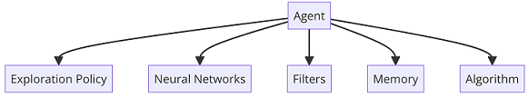

 **Reinforcement Learning (RL)** 
Reinforcement Learning (RL) is a type of Machine Learning that is based on feedback and enables an agent to learn how to interact with an environment through executing various actions and monitoring their outcomes. Rewards are provided for successful activities and penalties are imposed for unsuccessful ones, allowing the agent to learn from trial and error over time and thus become more competent in completing a given task.

 

 **Elements of RL:**
 - Agent: The ability to interpret the environment and act on it.
 - Environment: Physical environment where the agent operates.
 - Action: Execution of actions by the agent.
 - State: The current state of the agent.
 - Reward: Feedback from the environment after the agent evaluates its actions.
 - Policy: The method by which the agent decides what action to take based on the current situation.
 - Value: The reward that an agent will receive for acting in a particular state.

 **Sequential Decision making:**
 - Goal: Select actions to maximize total future reward
 - Actions may have long-term consequences
 - Reward may be delayed
 - It may be better to sacrifice immediate reward to gain more long-term reward

 **Agent & Environment:**
 - At each step t, the agent:
   - Executes action $A_{t}$
   - Receives observation $O_{t}$
   - Receives scalar reward $R_{t}$
 - The environment:
   - Receives action $A_{t}$
   - Emits observation $O_{t+1}$
   - Emits scalar reward $R_{t+1}$
 -  t increments at the environment step

---
**Multi-armed bandit Problem:** 
The multi-armed bandit problem is a classic example of reinforcement learning, in which there is a slot machine with n arms (bandits) that each has their own underlying probability distribution of success. Pulling any arm will result in either a stochastic reward of *R=+1* for success or *R=0* for failure. The objective of this problem is to maximize the total reward collected, by pulling the arms one by one in sequential order, over the long run. 
***Multi-armed bandit solutions:***
- ***ε-Greedy policy***: 
Initialize, for a = 1 to k: 
$Q(a) \leftarrow 0$ 
$N(a) \leftarrow 0$ 
Loop forever: 
$A\leftarrow argmax_{a}$ $Q(a)$ with probability $1-\epsilon$ or a random action with probability $\epsilon$ 
$R\leftarrow$ bandit or environment ( $A$ )  
$N(A)\leftarrow N(A)+1$ 
$Q(A)\leftarrow Q(A)+\frac{R-Q(A)}{N(A)}$ 
where *N* is the counter for how many times action a (bandit) was chosen in the past, and *R* are the stochastic rewards for each time that bandit was chosen. 
- ***Epsilon greedy Algorithm for N episode in stationary & non-stationary state:*** 
$Q(A) \leftarrow Q(A)+\frac{R-Q(A)}{N(A)}$; $N(A)\leftarrow$ *Average samples*  
$Q(A) \leftarrow Q(A)+\alpha*({R-Q(A)})$; $\alpha\leftarrow$ *Constant alpha*
   - Exploration-Exploitation in Epsilon Greedy Algorithm: 
*Exploitation* is when the agcanall his options and chooses the best option based on the previous success rates. Whereas *exploration* is the concept where the agent is unaware of his opportunities and tries to explore other options to better predict and earn rewards. 
   - Epsilon Greedy Action Selection:** The epsilon greedy algorithm chooses between *exploration* and *exploitation* by estimating the highest rewards. It determines the optimal action. It takes advantage of previous knowledge to choose exploitation, look for new options, and select exploration. 
   - Advantages of Epsilon Greedy Algorithm: The Epsilon greedy algorithm's significant advantage is that it is able to learn from past experiences, like other decision-making models, and explore new outcomes. The ability to explore new situations and have diverse knowledge leads to better decision-making. 
   - Disadvantages of Epsilon Greedy Algorithm:  A greedy algorithm such as Epsilon can sometimes explore new parameters and determine which user is dissatisfied. 
- ***Upper Confidence Bounds policy (UCB)*** $A_{t} = argmax {\left\lbrack\ Q_{t} + c*\sqrt{log(t) \over N_{t}(a)} \right\rbrack}$ 
- ***Stochastic gradient ascent policy (SGA)*** 
    $Pr({A_{t}=a})$ = $e^{H_{t}(a)}\over{\sum_{b=1}^k e^{H_{t}(b)}}$ = $\pi_{t}(a)$
    $H_{t+1}(a) = H_t(a) + \alpha*(R_t - mean(R_t))(1_{\alpha=A_{t}} - \pi_{t}(a)$ 
    
  

---
**Reinforcement learning algorithms:** 

>***Dynamic Programming:*** 
>>***Iterative Policy Evaluation, for estimating*** $V \approx \nu_\pi$ : 
>   Input $\pi$, the policy to be evaluated 
>  Algorithm parameter: a small threshold $\theta > 0$ determining accuracy of estimation 
>  Initialize V(s), for all $s\epsilon S^+$, arbitrarily expect that $V(terminal) = 0$ 
>  Loop: 
>    $\Delta \leftarrow 0$ 
>    Loop for each $s\epsilon S$ 
>    $\nu \leftarrow V(s)$ 
>    $V(s) \leftarrow \sum_{a}\pi(a|s).\sum_{s^.,r}p(s^.,r|s,a)[r+\lambda V_{\pi}(s^.)]\Rightarrow$ Bellman equation for the State-value function           
>    $\Delta \leftarrow max(\Delta,|\nu-V(s)|)$ 
>    until $\Delta < \theta$ 
>
>>***Policy Iteration (using iterative policy evaluation) for estimating*** $\pi \approx \pi_.$ : 
>$\pi_0$  $\underrightarrow{E}$  $\nu_{\pi_0}$  $\underrightarrow{I}$  $\pi_1$ $\underrightarrow{E} ... \underrightarrow{I}$ $\pi_.$  $\underrightarrow{E}$  $\nu_.$ 
>*1. Initialization:* 
>$V(s)\epsilon R$ and $\pi(s) \epsilon A(s)$ arbitrarily for all $s \epsilon S$ 
>*2. Policy Evaluation:* 
>Loop: 
>  $\Delta \leftarrow 0$ 
>  Loop for each $s\epsilon S$ 
>  $\nu \leftarrow V(s)$ 
>  $V(s) \leftarrow \sum_{s^.,r}p(s^.,r|s,\pi(s))[r+\lambda V_{\pi}(s^.)]$ 
>  $\Delta \leftarrow max(\Delta,|\nu-V(s)|)$ 
>  until $\Delta < \theta$ (a small positive number determining the accuracy of estimation) 
>*3. Policy Improvement:* 
>policy_stable $\leftarrow$ true(1) 
>For each $s \epsilon S$: 
>   old_action $\leftarrow \pi(s)$ 
>   $\pi(s) \leftarrow argmax_a \sum_{s^.,r}p(s^.,r|s,a)[r+\lambda V_{\pi}(s^.)]$ 
>   If old_action $\neq \pi(s)$, then policy_stable $\leftarrow$ false(0) 
>If policy_stable, then stop and return $V \approx \nu_.$  and  $\pi \approx \pi_.$; else go to 2 
>
>>***Value Iteration, for estimating*** $\pi \approx \pi_.$ : 
>*Algorithm parameter:* a small threshold $\theta > 0$ determining accuracy of estimation 
>Initialize V(s), for all $s\epsilon S^+$, arbitrarily expect that $V(terminal) = 0$ 
>Loop: 
>  $\Delta \leftarrow 0$ 
> Loop for each $s\epsilon S$ 
>  $\nu \leftarrow V(s)$ 
>  $V(s) \leftarrow max_a \sum_{s^.,r}p(s^.,r|s,a)[r+\lambda V(s^.)]$ 
>  $\Delta \leftarrow max(\Delta,|\nu-V(s)|)$ 
>  until $\Delta < \theta$ 
>  Output a deterministic policy, $\pi \approx \pi_.$, such that 
>  $\pi(s) = argmax_a \sum_{s^.,r}p(s^.,r|s,a)[r+\lambda V(s^.)]$ 
>
> 
  
>
>***Monte Carlo Methods:*** 
>>***First-visit MC prediction, for estimating*** $V \approx \nu_\pi$ : 
>*Input: a policy* $\pi$ *to be evaluated* 
>*Initialize:* 
>   $V(s)\epsilon R$, *arbitrarily, for all* $s\epsilon S$ 
>   *Returns(s)* $\leftarrow$ *an empty list, for all* $s\epsilon S$ 
>*Loop (for each episode):* 
>*Generate an episode following* $\pi: S_0, A_0, R_1, S_1, A_1, R_2,..., S_{T-1}, A_{T-1}, R_T$ 
>$G \leftarrow 0$ 
>*Loop for each of episode, t=T-1, T-2, ... 0:* 
>$G \leftarrow \lambda G+R_{t+1}$ 
>*Unless* $S_t$ *appears in* $S_0, S_1, ..., S_{t-1}:$ 
>*Append G to Retuens* $(S_t)$ 
>$V(S_t) \leftarrow$ average(Retuens $(S_t))$ 
>
>>***Monte Carlo ES (Exploring Starts), for estimating*** $\pi \approx \pi_.$ : 
>*Initialize:* 
>$\pi(s)\epsilon A(s)$, *arbitrarily, for all* $s\epsilon S$ 
>$Q(s,a)\epsilon R$, *arbitrarily, for all* $s\epsilon S, a\epsilon A(s)$ 
>*Returns(s,a)* $\leftarrow$ an empty list, for all $s\epsilon S, a\epsilon A(s)$ 
>*Loop (for each episode):* 
>*Choose* $S_0\epsilon S, A_0\epsilon A(S_0)$ *randomly such that all pairs have probability > 0* 
>*Generate an episode from* $S_0, A_0,$ *following* $\pi:S_0, A_0, R_1, S_1, A_1, R_2,..., S_{T-1}, A_{T-1}, R_T$ 
>$G \leftarrow 0$ 
>*Loop for each of episode, t=T-1, T-2, ... 0:* 
>$G\leftarrow \lambda G+R_{t+1}$ 
>*Unless the pairs* $S_t, A_t$ *appears in* $S_0, S_1, A_1, ..., S_{t-1}, A_{t-1}:$ 
>*Append G to Retuens* $(S_t, A_t)$ 
>$Q(S_t, A_t)\leftarrow$ *average(Retuens*$(S_t, A_t))$ 
>$\pi(s) = argmax_a Q(s,a)$ 
>
>>***On-policy first-visit MC control (for*** $\epsilon$***-soft policies), estimates*** $\pi \approx \pi_.$ : 
>*Initialize:* 
>   *small* $\epsilon > 0$ 
>   $\pi(s)\leftarrow$ *arbitrarily* $\epsilon-soft$ *policy* 
>  $Q(s,a)\epsilon R$ *arbitrarily, for all* $s\epsilon S, a\epsilon A(s)$ 
>   *Returns(s,a)* $\leftarrow$ *empty list, for all* $s\epsilon S, a\epsilon A(s)$ 
>*Loop (for each episode):* 
>*Generate an episode following* $\pi:S_0, A_0, R_1, S_1, A_1, R_2,..., S_{T-1}, A_{T-1}, R_T$ 
>$G \leftarrow 0$ 
>*Loop for each of episode, t=T-1, T-2, ... 0:* 
>$G \leftarrow \lambda G+R_{t+1}$ 
>*Unless the pairs* $S_t, A_t$ *appears in* $S_0, S_1, A_1, ..., S_{t-1}, A_{t-1}:$ 
>*Append G to Retuens*$(S_t, A_t)$ 
>$Q(S_t, A_t)\leftarrow$ *average(Retuens*$(S_t, A_t))$ 
>$A^.\leftarrow argmax_a Q(S_t, a)$ 
>*For all* $a \epsilon A(S_t):$ 
>$\pi(a|S_t)\leftarrow 1-\epsilon+\epsilon/|A(S_t)|$ *if* $a=A^.$  *or* $\epsilon/|A(S_t)|$ *if* $a\neq A^.$
>
> 
>
>***Temporal Difference (TD) Learning*** 
>>***TD(0) algorithm:*** TD(0) is the simplest form of TD learning. This type of TD learning updates the value function with the value of each step along the way, and rewards along the way are obtained. After a sufficient number of samplings (in the limit of infinity), the observed reward is the key to keeping the algorithm grounded. 
>***Tabular TD(0) for estimating*** $\nu_\pi$: 
>*Input: the policy* $\pi$ *to be evaluated* 
>*Algorithm parameter: step size* $\alpha \epsilon (0, 1]$ 
>*Initialize V(s), for all* $s \epsilon S^+$, *arbitrarily expect that V(terminal)=0* 
>*Loop for each episode:* 
>*Initialize S* 
>*Loop for each step of the episode:* 
>$A \leftarrow$ *action given by* $\pi$ *for S* 
>*Take action A, observe R,* $S^.$ 
>$V(S) \leftarrow V(S) + \alpha[R+\lambda V(S^.)-V(S)]$ 
>$S \leftarrow S^.$ 
>*until S is terminal* 
>
>>***Q-Learning:*** Q-learning uses the off-policy learning technique, where the agent learns the desired actions based on the previous states and awards. A greedy search improves an agent's learning by considering only the maximum reward received for a particular set of actions. Previous states and previous rewards are considered for newer states of operations. 
>***Q-learning (off-policy TD control) for estimating*** $\pi \approx \pi_.$ : 
>*Algorithm parameters: step size* $\alpha \epsilon (0, 1]$, *small* $\epsilon > 0$ 
>*Initialize Q(s,a), for all* $s \epsilon S^+, a\epsilon A(s)$, *arbitrarily expect that Q(terminal, .)=0* 
>*Loop for each episode:* 
>*Initialize S* 
>*Loop for each step of the episode:* 
>*Choose A from S using policy derived from Q(e.g., e-greedy)* 
>*Take action A, observe R,* $S^.$ 
>*Choose* $A^.$ *from* $S^.$ *using policy derived from Q(e.g., e-greedy)* 
>$Q(S,A) \leftarrow Q(S,A) + \alpha[R+\lambda max_a Q(S^., a)-Q(S, A)]$ 
>$S \leftarrow S^.$ 
>*until S is terminal* 
>
>>***State Action Reward State Action (SARSA):*** The SARSA algorithm uses the On-policy for learning, in which the agent learns from the current set of actions in the current state and the target policy. Previous states and previous rewards are not considered for newer states of operation.  
>***Sarsa (on-policy TD control) for estimating*** $Q \approx q_0$ : 
>*Algorithm parameters: step size* $\alpha \epsilon (0, 1]$, *small* $\epsilon > 0$ 
>*Initialize Q(s,a), for all* $s \epsilon S^+, a\epsilon A(s)$, *arbitrarily expect that Q(terminal, .)=0* 
>*Loop for each episode:* 
>*Initialize S* 
>*Choose A from S using policy derived from Q(e.g., e-greedy)* 
>*Loop for each step of the episode:* 
>  *Take action A, observe R,* $S^.$ 
>  *Choose* $A^.$ *from* $S^.$ *using policy derived from Q(e.g., e-greedy)* 
>  $Q(S,A) \leftarrow Q(S,A) + \alpha[R+\lambda Q(S^., A^.)-Q(S, A)]$ 
>$S \leftarrow S^.; A\leftarrow A^.$ 
>*until S is terminal* 
>
>>***Deep Q Neural Network (DQN):*** DQN, is Q learning with the help of neural networks. Defining and updating a Q-table in a large state space environment is a daunting task. To solve this very issue, we use the DQN algorithm to approximate Q values for every action and state. 
>
>    
